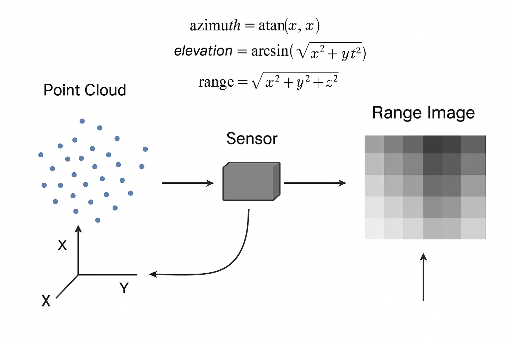

# 1、Range Image
Range Image 是一种表示三维场景的图像化方式。每个像素存储的不是颜色，
而是该像素对应方向上 到场景中最近物体的距离（Depth/Range）。
- 本质：把 3D 点云投影到一个二维图像平面上，每个像素表示一个方向。
- 存储信息：距离信息（有时也叫深度，单位一般为米）。
- 常见来源：激光雷达（LiDAR）、深度相机、模拟深度传感器。
# 2、点云转化成深度图的流程

```
点云（x,y,z）
       │
       ▼
世界坐标 → 传感器坐标 (sensorPose)
       │
       ▼
球坐标转换 (azimuth, elevation, r)
       │
       ▼
像素坐标投影 (u, v)
       │
       ▼
深度选择 (取最近点, 忽略盲区, 平滑噪声)
       │
       ▼
填充 RangeImage
       │
       ▼
生成二维深度图
```
# 3、具体流程操作
## 1. 输入
- 点云：pcl::PointCloud<PointT>，每个点有 x,y,z 坐标，可能还有颜色、强度等信息。
- 传感器参数：
  - angularResolution：每个像素对应的角度
  - maxAngleWidth / maxAngleHeight：传感器视场
  - sensorPose：传感器在世界坐标系的位姿（旋转 + 平移）
  - coordinate_frame：选择坐标系（CAMERA_FRAME 或 LASER_FRAME）
  - noiseLevel / minRange / borderSize：噪声和边缘处理参数
## 2. 坐标变换
  - 将点云中的每个点 从世界坐标系转换到传感器坐标系：

    `p_sensor=T_sensor−1 ⋅ p_world`
  - T_sensor 是 sensorPose，包含旋转和平移
  - 转换后点云的原点位于传感器位置，Z 轴指向传感器正前方
## 3. 计算极坐标/球坐标
- 对每个点计算 方位角（azimuth）和俯仰角（elevation）：

    `azimuth = arctan2(y,x)`

    `elevation = arcsin(z/sqrt(x*x + y*y + z*z))`
- 这里 (x, y, z) 是点在传感器坐标系下的位置
- 距离（range）：

  `range = sqrt(x*x + y*y + z*z)`

## 4. 投影到深度图像平面
- 深度图的像素坐标

    `u = (azimuth + 0.5*maxAngleWidth)/angularResolution`

    `v = (elevation + 0.5*maxAngleHeight)/angularResolution`
- (u,v) 即深度图中对应的像素索引
- 如果某个像素有多个点落入，通常取最近的点（最小 r），这就是深度图的本质
## 5. 处理噪声和最小测距
- 距离小于 minRange 的点 → 忽略（盲区）
- 相邻点距离差小于 noiseLevel → 平滑或舍弃
- 边缘像素通过 borderSize 扩展，避免空洞
## 6. 填充 RangeImage 数据结构
- pcl::RangeImage内部存储二维矩阵，每个元素是距离值
- 对应CAMERA_FRAME：X 右，Y 下，Z 前
- 对应LASER_FRAME：X 前，Y 左，Z 上
- 可以附加信息：每个像素的点索引、法向量、有效标记等
## 7. 输出
- 得到 pcl::RangeImage 对象
- 可以可视化、做特征提取、生成法向量、NARF 特征等
